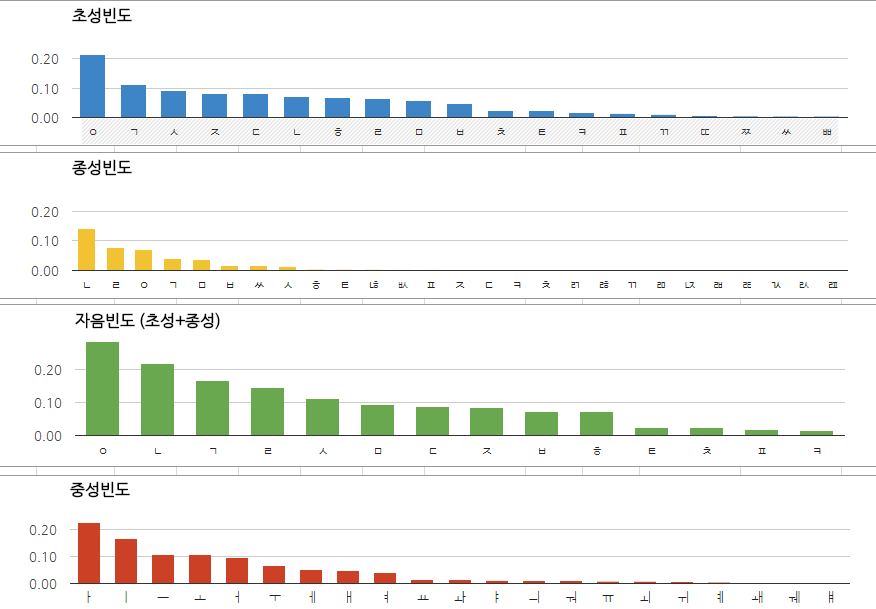
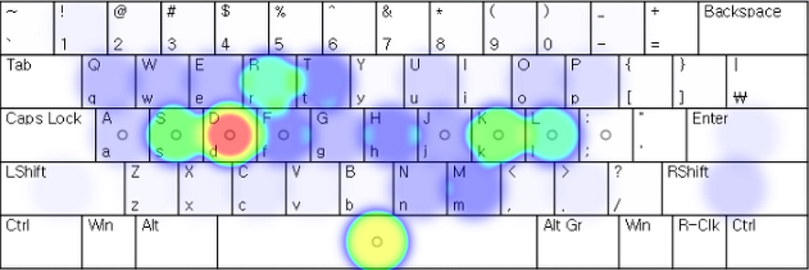
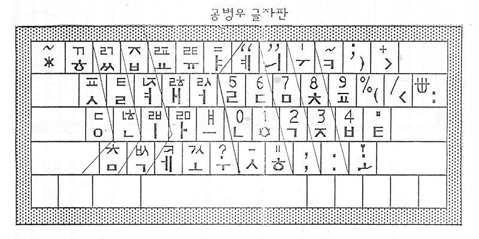
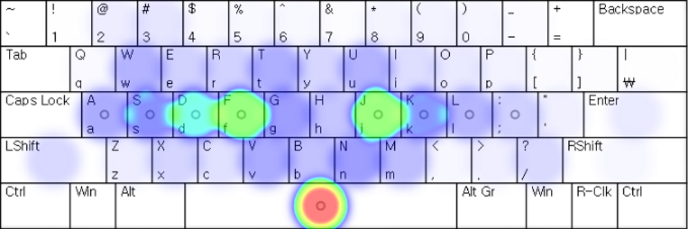
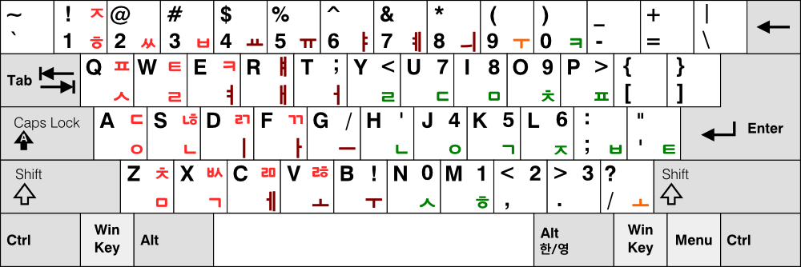

## 세벌식이란?
세벌식은 초성, 중성, 종성으로 나누어진 키보드 자판 배열을 뜻합니다.

현재 우리나라의 표준 자판(KS X 5002)은 자음과 모음이 각 한 벌씩 배치되어 있는 두벌식 자판입니다. 이에 비해 세벌식 자판은 초성, 중성, 종성이 각각 한 벌씩 배치되어 있습니다.

타자할 때 받침까지 구별해야 한다니, 불편할 것 같다고요? 전혀 아닙니다. 아래 내용을 5분만 투자해서 읽어 주세요.

-----

## 세벌식이 좋은 이유
> **설명을 읽기 귀찮으신 분들을 위한 세줄 요약**:
> 1. 빠르다
> 2. 편안하다
> 3. 오타가 덜 난다

### 빠르다
다음 그림은 한글 문장에서 각 자소(초성, 중성, 종성)가 쓰이는 빈도를 나타낸 그래프입니다.

이 그림을 보면 어떤 자소가 문장에서 얼마나 자주 쓰이는지를 알 수 있습니다.

다음 그림은 현행 표준 두벌식 자판의 배열도입니다.

상식적으로 생각해 봤을 때, 컴퓨터 자판의 글쇠(키) 배열은 가장 자주 치게 되는 글쇠들을 힘이 좋은 검지와 중지로 치게 하고, 덜 자주 치는 글쇠일수록 힘이 약한 약지와 소지로 치도록 배치하는 것이 빠르고 효율적일 것입니다.

하지만 위의 두 그림을 비교해 보면, 현행 표준 자판은 두 번째로 많이 쓰이는 모음 ㅣ를 약지로 치는 글쇠에 배열해 놓고, 나머지 자모들도 자소 빈도에 따라 배열해놓지 않은 것을 볼 수 있습니다. 받침으로서는 ㅅ보다 더 많이 쓰이는 ㅆ는 아예 쉬프트를 누르고 쳐야 하는 윗글쇠에 배정해놓은 모습입니다.

이에 반해 세벌식 자판(그림은 세벌식 최종)은 가장 자주 쓰이는 ㅇ, ㄱ, ㅏ, ㅣ를 가운데에 놓고 빈도가 낮을수록 그 주변으로 퍼져나가는 형태로 자모가 배열되어 있습니다. 그래서 세벌식을 쓰면 힘이 약한 손가락보다 힘이 좋은 손가락을 더 많이 쓰게 되어 손가락 피로도가 줄어들고, 그에 따라 타자를 오래 하더라도 타자 속도가 많이 떨어지지 않습니다.

이 차이는 각 자판의 타자 빈도 분포도를 보면 확실히 드러납니다. 표준 두벌식에 비해 세벌식 자판이 검지와 중지를 더 많이 쓰고, 쉬프트를 덜 누르는 것을 확인할 수 있습니다.

### 편안하다
세벌식은 받침을 구별해서 쳐야 하므로 사용하기 번거롭고 속도가 더 느릴 것 같지만, 전혀 아닙니다. 오히려 받침을 구분하면서 생기는 이점이 더 많습니다.

故 공병우 박사가 개발한 통칭 공세벌식 자판은 초성이 오른쪽, 중성이 중간, 종성이 왼쪽에 배열되어 있습니다. 한글의 한 음절은 초성으로 시작해서 중성이나 종성으로 끝나기 때문에 세벌식 자판으로 타자를 치면 한 음절을 칠 때의 흐름은 오른쪽에서 시작해서 왼쪽에서 끝나게 됩니다.

이 과정을 빠르게 반복하게 되면서 타자가 리드미컬하게 쳐지는, 일명 '리듬감'이 발생하게 됩니다. 다음은 표준 두벌식과 세벌식 최종으로 '생일'을 입력할 때의 타자 흐름을 나타낸 그림입니다.

두벌식 자판을 쓰면 오른손과 왼손을 불규칙하게 번갈아가며 쓰기 때문에 이 리듬감을 느끼기 힘들지만, 세벌식 자판을 쓰면 이 리듬감 덕분에 손목이 비교적 편안해집니다.

### 오타가 덜 난다
앞서 말한 오른쪽에서 시작해서 왼쪽에서 끝나는 리듬감있는 타자 덕분에 자음과 모음의 순서를 틀려서 생기는 'ㅇ벗다'나 '스빈다' 같은 오타도 나지 않습니다. 하지만 여기서 끝이 아닙니다.

세벌식을 지원하는 일부 입력 소프트웨어에서는 '모아주기'라는 기능을 지원합니다. 이 기능을 사용하면 초성·중성·종성 순서를 틀리게 치더라도 알아서 교정해 줍니다. 'ㅅ-ㅡ-ㅂ-ㅣ-ㄴ-ㄷ-ㅏ'의 순서로 치더라도 자동으로 '습니다'가 된다는 것이죠. 어떻게 그런 게 가능하냐고요?

바로 받침을 구분하기 때문입니다. 글쇠 하나를 초성과 종성 두 가지로 쓰는 두벌식 자판에서는 자음 키를 누르면 앞에 모음이 있느냐 없느냐에 따라 종성으로 입력될지 초성으로 입력될지 결정되지만, 세벌식 자판은 언제 어느 키를 입력하더라도 초성인지 종성인지 구분이 되어 있으므로 알아서 모아줄 수가 있는 것입니다.

-----

## 세벌식을 씁시다
위와 같은 사실들로 미루어봤을 때, 세벌식은 표준 두벌식 자판보다 더 빠르고 편한 자판이라고 생각해 볼 수 있습니다.

그러나, 비표준 자판이라는 점과 인지도 부족 등으로 인해, 현재 세벌식은 한국의 전체 컴퓨터 사용자의 2% 미만(추정)이 사용하고 있습니다.

이에 저는 빠르고 편한 세벌식을 모두에게 알리고, 사용을 권하기 위해 이 캠페인을 시작했습니다.

이 캠페인으로 인해 세벌식을 쓰는 사람이 늘어나면 그에 대한 국가와 기업들의 지원도 늘어나고, 결과적으로는 현행 표준 두벌식과 함께 복수 표준으로 인정받을 수도 있을 겁니다.

여러분도 관심이 있으시면 세벌식을 한번쯤은 사용해 보시기를 권하는 바입니다.

-----

## 세벌식에 관한 오해와 사실들
#### 세벌식을 쓰려면 세벌식 키보드를 사야 한다?
전혀 아닙니다. 지원하는 입력기의 경우 입력기 설정을 바꾸거나, 세벌식을 지원하는 입력기를 설치하는 것 만으로 세벌식을 사용할 수 있습니다.

물론, 속기사들이 쓰는 키보드는 일반적인 키보드와 다르게 생겼고, 배열도 다릅니다.

#### 세벌식은 배우기 어렵다?
한글 자판에 할당된 키가 많아서 배우기 어려울 것 같지만, 자판은 머리로 외워서 치는 게 아니라 손에 익어서 치게 되는 것이므로 두벌식이든 세벌식이든 처음부터 배우려면 익숙해질 때까지 시간이 오래 걸립니다. 또한, 각 자판을 배우는 시간에 대한 통계가 따로 없어서 정확히 어느 자판이 배우기 쉽다고 하기는 어렵습니다.

#### 세벌식을 쓰게 되면 두벌식은 쓸 수 없다?
세벌식에 익숙해지고 나서도 약간의 시간동안만 다시 두벌식을 써 보면 세벌식과 두벌식 모두 익숙하게 사용할 수 있게 됩니다.

#### 세벌식은 숫자를 입력하기가 힘들다?
세벌식 390과 세벌식 최종은 자판의 맨 윗 열까지 한글 입력에 사용합니다. 대신 숫자는 쉬프트 키를 누른 상태로 오른손으로 입력하게 되어 있습니다. 익숙해지면 맨 윗 열로 숫자를 입력하는 것과 같거나 더 빠른 속도를 낼 수 있으며, 세벌식 390의 숫자 배열은 키보드의 숫자 패드와 똑같이 생겨서 숫자 패드가 따로 필요없게 될 수도 있습니다.

-----

## 나에게 맞는 세벌식 찾기

현재 쓰이는 세벌식은 공세벌식, 신세벌식, 모아치기 세벌식 등 여러 종류가 있지만, 여기서는 가장 기본 원리가 되고 가장 많은 사람들이 쓰는 걸로 알려진 세벌식 390이나 세벌식 최종 중에서 선택하는 것을 추천합니다.

세벌식 3-90 (세벌식 390)

세벌식 390은 1990년에 IBM 계열 컴퓨터를 위해서 고안된 자판으로, 영문 쿼티 자판에 있는 기호를 모두 입력할 수 있고, 기호 배열도 쿼티와 대부분 일치하게 되어 있습니다.

숫자 배열은 3줄로 키보드의 숫자 패드(넘패드)와 같이 되어 있습니다.

세벌식 3-91 (세벌식 최종)

세벌식 최종은 1991년에 매킨토시 컴퓨터를 위해서 고안된 자판으로, 영문 쿼티 자판에 있는 기호가 몇 가지 빠진 대신에 한글의 모든 겹받침을 쉬프트 + 한 타로 입력할 수 있으며, 한글 문장에서 쓰이는 문장부호인 ·(가운뎃점), ※(참고 표시), “”(열고 닫는 따옴표)를 입력할 수 있습니다.

숫자 배열은 2줄로 되어 있습니다. 대신 숫자와 함께 사용할 수 있는 ,와 .를 쉬프트를 누른 상태로 입력할 수 있습니다.

간단히 요약하면 한글 타자를 많이 한다면 세벌식 최종을, 프로그래밍을 하거나 그 외 보통의 경우에는 세벌식 390을 선택하면 됩니다.

둘 중 하나를 사용하다가 다른 쪽이 더 맞을 것 같으면 윗글쇠와 기호 자리만 새로 익히면 금방 다른 자판을 쓸 수 있습니다.

-----

## 세벌식을 쓰는 방법

### 세벌식 사용을 위한 프로그램
#### 타자 연습 프로그램
* [한컴 타자연습](https://www.hancom.com/hanfriends/friendsTyping.do) (웹, Windows)
* [날개셋 타자연습](http://moogi.new21.org/prg5.html) (Windows)
* [열린타자](https://github.com/suhdonghwi/OpenTyping) (Windows)
* [Taza](https://apps.apple.com/kr/app/taza/id452941048?mt=12) (macOS)

#### 세벌식을 지원하는 입력기
##### Windows
* 기본 한글 입력기에서 세벌식 390과 세벌식 최종 지원
* [날개셋 한글 입력기](http://moogi.new21.org/prg4.html)
* [새나루 입력기](http://kldp.net/saenaru/)
* [나빌입력기](https://github.com/navilera/NavilIME)

##### Linux
* ibus-hangul
* fcitx-hangul
* uim-byeoru
* nabi

##### macOS
* 기본 한글 입력기에서 세벌식 390과 세벌식 최종 지원
* [구름 입력기](http://gureum.io/)

##### Android
* [OpenWnn Korean](https://play.google.com/store/apps/details?id=me.blog.hgl1002.openwnn)
* [세삭 세벌식 입력기](https://play.google.com/store/apps/details?id=com.egloos.woongyee.sesak)
* [MN 로그인 키보드](https://play.google.com/store/apps/details?id=com.MobileNeuron.MNLogInKeyboard)
* [세나 입력기](https://play.google.com/store/apps/details?id=com.sleet.android.sebeol390keyboard)

##### iOS
* [세벌 키보드](https://itunes.apple.com/kr/app/%EC%84%B8%EB%B2%8C-%ED%82%A4%EB%B3%B4%EB%93%9C/id428835384?mt=8)

##### 웹
* [온라인 한글 입력기(팥알)](http://ohi.pat.im/)
* [온라인 한글 입력기(3beol)](https://3beol.github.io/)

※ 공공 PC를 사용할 때에는 두벌식 설정 그대로 사용하거나, 사용 후 다시 두벌식으로 바꿔놓는 매너를 가집시다.

#### 세벌식 연습하기
세벌식을 연습하는 데 따로 정해진 방법은 없습니다. 다만 익숙해지는 데에는 한 달 정도 걸리며, 세벌식을 연습하는 기간 중에는 세벌식과 두벌식 모두 잘 칠 수 없는 과정이 있을 수 있다고 알려져 있습니다.

##### 공세벌식을 연습할 때의 주의사항
세벌식 390이나 세벌식 최종을 연습할 때에는 다음을 주의해 주세요.
1. **각 글쇠는 그에 맞는 손가락으로 누르도록 한다.** - 세벌식은 운지법을 지키지 않으면 그 가치가 대폭 감소합니다.

1. **맨 윗 줄의 글쇠를 칠 때는 손가락만 뻗는 게 아니라 손목을 같이 움직인다.** - 손가락과 손목이 받는 피로가 줄어듭니다.

1. **이중모음에 쓰는 ㅗ, ㅜ는 오른쪽에 있는 글쇠를, 나머지는 왼쪽 글쇠를 친다.** 모음 ㅢ는 따로 마련된 글쇠를 이용한다. - 같은 손가락을 두세번 쓰는 것을 피할 수 있습니다.

1. **자판에 있는 겹받침은 쉬프트와 함께 한 타로 입력한다.** - 같은 손가락을 두세번 쓰는 것을 피할 수 있고, 리듬감도 살아납니다.

##### 세벌식 연습 팁
1. 글쇠 위치를 익힐 때에는 사용하는 스마트폰에 세벌식 키보드를 설치해서 사용하면 쉽게 익힐 수 있습니다.
1. 글쇠 위치를 어느 정도 익혔으면, 세벌식으로 인터넷 채팅 같은 것을 하면 속도가 금방 늘 수 있습니다.

-----

## 자료 출처
* 한글 자소 빈도 - [pxd UX Lab](http://story.pxd.co.kr/958)
* 표준 두벌식, 세벌식 3-90, 최종 배열표 - [글걸이](http://pat.im)
* 표준 두벌식과 세벌식 최종의 타자 빈도 분포도 - [세벌식 사랑 모임](http://cafe.daum.net/3bulsik/6CY8/281)

-----

## 의견을 남겨주세요
세벌식 사용 후기, 캠페인에 대한 의견 등을 남겨주시면 감사하겠습니다.
